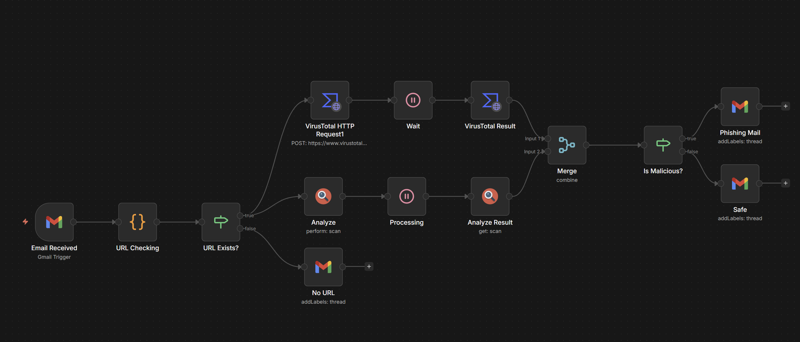

# phishing-sandbox-soar



## Phase 1: The Local Lab (Docker Setup)

We’ll use docker-compose to ensure data is **persistent** and **credentials** stay private.  
1. Create project directory  
   ```
    mkdir phishing-sandbox-soar && cd phishing-sandbox-soar
    mkdir n8n_data
    sudo chown -R 1000:1000 ./n8n_data
   ```
   * Set permissions so the n8n container user (1000) can write to it
2. Create a .env file
   ```  
    N8N_BASIC_AUTH_USER=admin
    N8N_BASIC_AUTH_PASSWORD=YourStrongPassword123!
    TZ=Asia/Singapore
   ```
3. Create ```docker-compose.yml```
    ```
    version: '3.8'
    services:
    n8n:
        image: n8nio/n8n:latest
        restart: unless-stopped
        ports:
        - "5678:5678"
        environment:
        - N8N_BASIC_AUTH_ACTIVE=true
        - N8N_BASIC_AUTH_USER=${N8N_BASIC_AUTH_USER}
        - N8N_BASIC_AUTH_PASSWORD=${N8N_BASIC_AUTH_PASSWORD}
        - TZ=${TZ}
        volumes:
        - ./n8n_data:/home/node/.n8n
    ```
## Phase 2: Building the SOAR Workflow
The workflow follows the NIST Incident Response Lifecycle (Detection, Analysis, and Containment).  
1. Ingestion: The Monitoring Gate  
   * **Node**: Gmail Trigger
   * **Configuration**: Polls the "Phishing" folder every 1 minute.
   * **Logic**: Uses a filter is:unread -label:Danger -label:Safe to prevent duplicate processing.
2. **Extraction**: IoC Identification
   * **Node**: Code (JavaScript)
   * **Function**: Uses a Regular Expression (Regex) to extract URLs from both the Plain Text and HTML body of the email.
   * **Cybersecurity Value**: This ensures "button-hidden" links in phishing emails are caught.
3. **Enrichment**: Threat Intelligence Integration
   * **Step A**: Submission (urlscan.io)
     * Submits the extracted URL to a headless browser sandbox for live detonation.
   * **Step B**: Wait Node
     * Pauses the workflow for 60 seconds to allow the sandbox to generate a screenshot and a security report.
    * **Step C**: Verification (VirusTotal - Engines)\
      * Queries VirusTotal to see how many professional security engines (e.g., CrowdStrike, Kaspersky) flag the URL.
4. **Logic**: The Automated Decision
   * **Node**: If Node
   * **Condition**: Checks if Engines Malicious ```Score >= 1``` or urlscan.io ```Score > 75```.
   * **Cybersecurity Value**: Eliminates human error by making objective, data-driven decisions.
5. **Remendation**: Containment & Response
   * True Path (Threat Detected):
     * Adds a Danger label to the Gmail thread.
     * (Optional) Sends a high-priority alert to Discord/Slack with the malicious IP and country.
   * False Path (No Threat):
     * Adds a Safe label to the thread to inform the user the link was analyzed and cleared.

## Phase 3: Validation & Testing
To prove the system works, we perform Live Fire Testing:  
1. Positive Test: Send a real phishing link from PhishTank to the inbox. Verify that the system correctly applies the Danger label.
2. Negative Test: Send a safe link (e.g., Google.com). Verify that it correctly applies the Safe label.
3. Edge Case Test: Send a link hidden inside a button to verify the HTML extraction logic.

---

## ⚠️ Disclaimer & Safety Warning
1. No Guarantee of Detection (False Negatives)
This tool is designed for educational and research purposes as a proof-of-concept for SOAR automation. While it utilizes reputable Threat Intelligence sources (VirusTotal and urlscan.io), no security tool can guarantee 100% detection. Attackers frequently use "Zero-Day" URLs, geofencing, and bot-detection evasion techniques that may result in a False Negative (a malicious link being labeled as "Safe").

2. Sandbox "Detonation" Risks
The urlscan.io node performs a "live detonation" by visiting the URL in a headless browser. While this happens on their servers and not your local machine, always treat the results with caution. Never manually visit a URL flagged as Danger without an isolated malware analysis environment (e.g., a dedicated VM or Any.run).

3. API Quotas & Service Availability
This workflow depends on the availability and free-tier limits of third-party APIs. If your daily API quota for VirusTotal or urlscan.io is exceeded, the workflow will fail to enrich data, potentially leaving malicious emails unprocessed.

4. Data Privacy
By using this workflow, you are submitting URLs found in your emails to third-party services for analysis. Be aware that sensitive or private URLs (such as password reset links or private document shares) may be logged by these services. Use the "Private" scan setting in urlscan.io where possible to minimize public exposure.

5. Limitation of Liability
The author of this project is not responsible for any security breaches, data loss, or system compromises that may occur in your environment. This tool should be used as a supplement to, not a replacement for, enterprise-grade email security solutions.